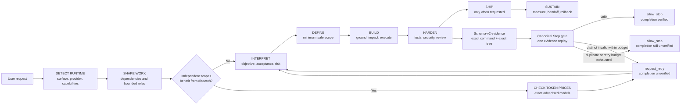

# DAI Harness

**One sentence of intent → one shipped application, with the evidence to show it.**

DAI Harness is an operating harness for AI coding agents: a fixed kernel loaded every
session, a library of specialist skills loaded on demand, and a dependency-free Python
runtime that enforces evidence — an agent may not say "done" without a record the
machine wrote itself.

## Three layers

> **An AI harness that records failures and reuses verified lessons.** DAI Harness is designed to reduce repeated failure patterns; recurrence is measured rather than assumed away.

DAI Harness is an open-source engineering harness that adds evidence-gated delivery workflows around the model provider and tools you configure. It coordinates definition, building, hardening, and shipping while keeping provider-specific execution inside that provider's native ecosystem.

---

## Roadmap and Evidence Status

The roadmap tracks 19 historical deliverables from P0.1 through P3.4 without collapsing artifact presence into product completion. The machine-readable [completion manifest](docs/roadmap-completion.json) records implementation, integration, activation, production evidence, and measured outcome separately, with executable local verifier contracts and rollback strategies; the [active roadmap](docs/active-roadmap.md) records the current dependency order and evidence boundaries.

- Verification runs locally and does not require GitHub Actions or paid hosted CI.
- Provider and model selection is capability-driven. The core does not require one provider, model catalog, or API.
- Provider-native execution stays within the selected provider's own CLI or ecosystem adapter.
- Live adaptive-routing gates P2.2–P2.5 remain disabled until that provider produces trustworthy native receipts. Fixtures, generic CLI probes, and local smoke markers cannot enable them.
- Gemini API integration is not part of the roadmap. Antigravity CLI may be used as one optional provider-side validation instance, not as a core dependency.

Replay the complete roadmap evidence contract locally:

```bash
npm run verify:roadmap
```

---

## Continuous Project Control Center

This release turns project documentation from scattered Markdown snapshots into
a continuously refreshed, local-first HTML control center:

- **Canonical sources stay authoritative.** Documentation governance updates an
  existing approved source whenever possible and rejects duplicate, transient,
  out-of-scope, generated-source, or unresolved stale documentation.
- **HTML stays current during delivery.** Material work requires a strict
  baseline plus persistent build before edits, a canonical-state update and
  rebuild at each meaningful checkpoint, then a worktree gate and final build
  before handoff.
- **Project flows are visual.** Every flow in `docs/project-state.json` is
  rendered as an accessible Mermaid-derived static SVG, with the Mermaid source
  and ordered steps retained as fallbacks.
- **Dispatch is runtime- and cost-aware.** Each request identifies the active
  Codex, Claude Code, Antigravity, Cursor, or other runtime. Candidate subagent
  models are compared using current first-party input/cached-input/output token
  prices, but routing prioritizes effectiveness, wall-clock speed, total tokens,
  then estimated token cost. Small coupled work stays parent-owned.
- **Canonical rules stay visible without blocking work.** Provider-native
  lifecycle hooks inject a bounded inventory plus fair excerpts for every
  active rule in `kernel/rule-manifest.json`. They default to advisory
  `observe`, preserve the existing Stop/security gates, and fail open on
  missing runtimes, malformed payloads, invalid manifests, or timeouts. Set
  `DAIHARNESS_RULE_HOOK_MODE=off` for the immediate kill switch.

The generated site is written to `.daiharness/docs-hub/site/`; open
`.daiharness/docs-hub/site/index.html` for the project overview or
`.daiharness/docs-hub/site/projects/<project-id>/flows.html` for the Mermaid
flow control view. Generated HTML is inspectable output, never source truth.

The Stop lifecycle performs only a read-only Docs Hub continuity check. Its
default `observe` mode reports stale or missing HTML evidence as `UNVERIFIED`
without blocking; optional `DAIHARNESS_DOCS_CONTINUITY_MODE=enforce` may ask
for one refresh when a present receipt is provably stale, then always allows
the next pass to prevent retry storms. Use `off` to disable this check.

**[Read the Docs Hub Guide ➔](docs/guides/docs-hub.md)** ·
**[Read the Pipeline Reference ➔](docs/pipeline-reference.md)**

---

## Pipeline Flow

DAI Harness separates delivery phases from the runtime controls that prove and
close a task. Small local work may compress irrelevant phases; HARD work expands
the same boundaries.



| Boundary | Machine behavior | Loop/authority limit |
| --- | --- | --- |
| Host compatibility | `HarnessAdapter v1` negotiates owned/native loops and `start`, `resume`, `fork`, `steer`, `interrupt`, `checkpoint` support | Unknown or unsupported lifecycle operations fail closed; provider model IDs are not part of the core contract |
| Verification | Schema-v2 evidence binds acceptance IDs, exact argv, negative paths, output digest, and exact worktree | A Stop event replays the canonical evidence command at most once |
| Stop re-entry | At most two distinct invalid attempts are recorded per session/turn/tree scope; identical re-entry or exhausted budget terminates the host interaction | Termination never upgrades `completion_state`; suppressed retries remain `unverified` |
| Runtime lifecycle | MCP instances reconcile prior leases at startup and hold owner-token leases bound to PID start, PGID, parent identity, command digest, session, TTL, and version | Only the positive PID of an exact owned lease may receive TERM/KILL; dead leases close without a signal, while reused, rotated, unowned, or in-flight processes are preserved |
| Context continuity | Material events write project/session-scoped `dai-harness-continuity/v1` checkpoints whose head binds the complete prior-hash chain | Checkpoints are context-only; head/chain/tree/ledger mismatch requires fresh grounding and cannot authorize tools or completion |

The current local upgrade completes the Stop/replay boundary, the
`HarnessAdapter v1` contract, MCP ownership leases, and event-driven continuity.
`TrajectoryLedger`, execution containment, full-loop record/replay, and live
provider evidence remain ordered work in the [active roadmap](docs/active-roadmap.md).
The design choices and their primary-source evidence are recorded in the
[harness runtime research and decision log](docs/harness-runtime-research.md).

---

## Why DAI Harness / Who It Is For

Raw language models are only a small part of a functional AI coding agent. Without a disciplined framework, agents hallucinate, lose context, and repeat errors. DAI Harness wraps AI execution in an uncompromising delivery harness designed for professional engineering teams.

### Key Outcomes

- **Bounds repeated failure patterns**: The kernel stops the same failed approach after two attempts, requires new evidence or escalation, and bounds invalid Stop-hook re-entry without turning an unverified task into a verified one.
- **Project-Specific Continuity**: Material decisions, verifier results, handoffs, blockers, and terminal boundaries can write a hash-chained project/session checkpoint. SQLite-backed memory remains optional retrieval context, never project truth.
- **Pipeline Execution**: Requests use a right-sized engineering lifecycle. Clear local work stays compact; public contracts, security, concurrency, release, and other HARD signals expand verification and review before completion is claimed.
- **Evidence-Gated Testing**: Test and verification integrations are available where configured. They provide local evidence for the checks actually run; they do not guarantee zero escaped bugs.
- **Local-first state**: Project memory and orchestration state are stored in the workspace by default. Prompts, code excerpts, and tool results may still be sent to the model or tool providers you configure; use a local model and local tools when data must stay on-device.

### Who It Is For

- **Senior Engineers** needing an intelligent rubber-duck and rapid prototyping agent.
- **Development Teams** looking to automate repetitive boilerplate, refactoring, and test generation.
- **QA Engineers** desiring robust autonomous integration tests.

**[Read the Full Product Overview ➔](docs/product-overview.md)**

---

## 30-Second Example

DAI Harness takes abstract prompts and manages the complete lifecycle autonomously.

```text
You: "Build a React login form with JWT auth"

DAI Harness responds:
━━━━━━━━━━━━━━━━━━━━━━━━━━━━━━━━━━━━━━━━━━━━━━━━━
🤔 INTERPRETING...
   Intent: Feature request
   Mode: Feature
   Confidence: HIGH

📋 PLANNING (Plan Quality Loop)...
   Score: 9.5/10 ✓

⚡ EXECUTING...
   [████████████████████░░░░] 85%

   ✓ Component created (auth/LoginForm.tsx)
   ✓ JWT middleware added
   ✓ Unit tests written (3 passing)
   ✓ Security audit passed

✅ DONE (Score: 92/100)
   • 4 files created
   • All tests passing
   • No security issues
   • Ready for production

💡 Lesson learned: JWT refresh token rotation
━━━━━━━━━━━━━━━━━━━━━━━━━━━━━━━━━━━━━━━━━━━━━━━━━
```

For supported, configured paths, DAI Harness can create files, run configured tests, and record verifier output. Whether a particular task uses those paths depends on the selected runtime and available tools; see the [canonical-runtime ADR](docs/adr/0001-canonical-production-runtime.md).

---

## Prerequisites and Quick Start

DAI Harness is designed to run locally alongside your preferred IDE and development stack. It operates primarily as a Model Context Protocol (MCP) server, integrating seamlessly into modern AI-assisted editors.

### Prerequisites

Please ensure the following dependencies are installed and available in your system path:

- **Node.js**: v22.x or higher for supported DAI Harness runtime and CLI usage; CI validates Node.js 24 LTS with a Node.js 22 compatibility lane.
- **Git**: v2.30+ (required for repository management and history tracking).
- **Python**: v3.8+ (harness scripts and gates; memory itself is the DAI memory layer on Node.js).

> No `python` alias on Windows? Use `py -3` in every command below. The hooks in
> `.claude/settings.json` already do.
- **Supported IDE**: Cursor, Claude Desktop, or Codex CLI.

### Verified Install Paths for Supported IDEs

For the best experience, we recommend using DAI Harness in **Cursor** or **Claude Desktop** via the Model Context Protocol (MCP). The following setup flow integrates DAI Harness directly into your target repository as a submodule. This allows it to track your project's unique configuration securely and persistently across different developer machines.

#### Step 1: Clone DAI Harness as a Git Submodule

Integrating DAI Harness directly into your target repository allows it to maintain a project-specific memory bank and execution context. Open your terminal, navigate to the root of your project repository, and execute the following commands:

```bash
cd /path/to/your-project
git submodule add -b main https://github.com/Exia-thd/DAI-harness.git dai-harness
git submodule update --init --recursive
```

#### Step 2: Install the Memory layer

The memory layer is DAI Harness's code intelligence and its project memory: it
records why decisions were made, and indexes what each file declares and what
those declarations do to each other, so the agent can answer questions about a
codebase without reading all of it into context.

It is installed outside the repository — installed it is about 500 MB, and this
project's verifiers copy and fingerprint the whole worktree.

```bash
python scripts/lite/dai_memory.py install    # dependencies, build, embedding model
dai-memory init                              # build the store and the code graph
```

`init` scans the repository and builds the graph. After a commit or a merge,
`dai-memory ingest` re-reads what changed; `dai-memory status` says which commit
the index was built at and whether the working tree has moved past it.

#### Step 3: Run the MCP Setup Script

The MCP setup script automatically configures your local environment to recognize DAI Harness's capabilities. It modifies the necessary configuration files for Claude Desktop, Cursor, Antigravity, and Codex CLI.

```bash
bash daiharness/scripts/daiharness-mcp-setup.sh
```

#### Step 4: Initialize the Required Rules and Constraints

DAI Harness relies on strict system prompts to maintain its behavioral constraints. You must copy these rule files to the root of your project so that your IDE's AI assistant can read them automatically upon initialization.

```bash
cp daiharness/AGENTS.md .
cp daiharness/CLAUDE.md .
```

*Final Step:*
You must restart your IDE completely (e.g., CMD+Q on Mac) to force it to load the newly installed MCP servers. Once the IDE has restarted, open your AI chat panel and verify the installation by running `/onboard`.

#### Step 5: Enable Antigravity CLI (`agy`) Enforcement

Every developer or CI machine that uses `agy` must install the machine-level
Antigravity hook and the parent repository's update hooks once:

```bash
bash daiharness/scripts/daiharness-install.sh --profile minimal --yes
bash daiharness/scripts/daiharness-hook-doctor.sh --quick --fix
bash daiharness/scripts/lite/install-submodule-update-hooks.sh "$PWD"
```

The installer adds the native named `PreToolUse` policy hook to
`~/.gemini/config/hooks.json`. This is Antigravity CLI configuration and is
separate from Gemini CLI's `.gemini/settings.json`. Setup and `doctor --fix`
also seed `.daiharness/execution-policy.yaml` into the parent workspace when
it is missing; an existing file or symlink is always preserved. Confirm the installation:

```bash
bash daiharness/scripts/daiharness-hook-doctor.sh --quick
```

After this one-time setup, `post-merge` and `post-checkout` in the parent
repository automatically check `origin/main`. When the submodule is clean and
can be fast-forwarded, DAI Harness updates it and refreshes the installed
Antigravity hook runtime, doctor checks, and MCP configuration. Local submodule
changes or divergent history are never overwritten. Opening `agy` itself does
not fetch Git; the automatic update happens during the preceding parent Git
pull, merge, or checkout.

Use DAI Harness-managed delegation, escalation, benchmark, or parallel-dispatch
commands whenever possible. These paths invoke the real `agy` binary with an
explicit sandbox and mode, validate the global policy hook, and provide the
canonical workspace through `DAIHARNESS_WORKSPACE`.

If you intentionally invoke `agy` directly from a project root, provide the
workspace and select a mode explicitly:

```bash
DAIHARNESS_WORKSPACE="$PWD" agy --sandbox --mode accept-edits
```

Current `agy 1.1.2 --print` builds may send an empty `workspacePaths` hook
field. Without `DAIHARNESS_WORKSPACE`, the DAI Harness hook therefore fails
closed and can deny otherwise safe tool calls. The checked-in
`.agents/hooks.json` is retained for project portability, but the tested runtime
loaded the global registry; do not remove the global hook.

---

## Four Operating Levels

DAI Harness adapts to the scale of your project, offering different tiers of autonomy and intelligence based on the complexity of your requirements. You can start small and progressively enable more advanced features as your project matures.

| Level | Features | Setup Required | Best For |
| --- | --- | --- | --- |
| **Level 1**<br/>Zero Setup | Basic chat, 84 auto-activated skills | Just run your AI chat | Quick questions, single-file scripts |
| **Level 2**<br/>Code Intelligence | `dai_memory_impact`, `dai_memory_query`, `dai_memory_rename` | `python scripts/lite/dai_memory.py install` | Refactoring, code reviews, debugging |
| **Level 3**<br/>Continuity + GraphRAG | Event-driven bounded checkpoints plus optional local retrieval context | Python 3.8+ | Long-running projects, complex domains |
| **Level 4**<br/>Full Power | Parallel dispatch, multi-repo support, full pipeline orchestration | MCP Setup script | Team projects, end-to-end autonomous dev |

### How to Access Different Levels

#### Level 1: Zero Setup

By default, executing DAI Harness places you in Level 1. The agent will rely primarily on its base instructions and standard conversational abilities, using standard MCP tools for basic file reads and writes.

#### Level 2: Code Intelligence

To utilize Level 2 Code Intelligence, install the memory layer and index the project (`dai-memory init`). Whenever you ask the agent to refactor code, it invokes `dai_memory_impact` before making changes — and `dai_memory_rename` rather than a find-and-replace, because that walks the call graph instead of the text.

#### Level 3: GraphRAG Memory

Level 3 requires Python 3.8+ and can add a local SQLite retrieval index. Durable
resume state is stored separately as project/session-scoped continuity
checkpoints under `.daiharness/runtime/`; retrieved memory is re-grounded
against current files and cannot authorize execution or verification.

#### Level 4: Full Power

Level 4 unlocks the Parallel Dispatch workflows and the complete multi-agent pipeline. It requires the MCP server to be fully configured in your IDE. At this level, the orchestrator acts as an autonomous engineering team, breaking complex tasks into sub-tasks and executing them in isolated Git worktrees.

---

## Core Capabilities

DAI Harness bundles advanced software engineering workflows into focused, accessible tools that run directly inside your local environment.

### 1. Code Intelligence (memory layer)

DAI Harness builds a structural graph of a supported codebase with the memory layer, and records the reasoning behind it in the same store. The kernel requires impact analysis before symbol edits; compatibility paths and user overrides are not universally enforced. Graph queries supplement rather than replace text search, every answer states what it could not see, and an index older than the working tree says so rather than answering from stale positions.
**[Read the Memory layer Guide ➔](docs/guides/dai-memory.md)**

### 2. Autonomous Testing Stack

Automated shifting-left test logic can integrate Property-Based Testing (PBT), mutation testing, and Appium/Maestro where configured. Behavioral test oracles are requirement-locked: a red suite or the current implementation is not authority to rewrite assertions, expected outputs, snapshots/goldens, eval labels, skips, or scenarios. When expected behavior is missing or contradictory, DAI Harness must ask the user/product owner; behavioral tests change only after an explicit current requirement/acceptance change. Test-runner and setup/teardown plumbing may be repaired independently only when the behavioral oracle and coverage remain unchanged. The checks that run are recorded as evidence; this repository does not claim that every runtime writes tests first or blocks every coverage decrease.
**[Read the Testing Stack Guide ➔](docs/guides/testing-stack.md)**

### 3. Persistent Cognitive Memory (memory layer)

Decisions, incidents and constraints are recorded with the reason behind them and retrieved when an agent meets unfamiliar code. Retrieval fuses keyword, semantic and recency ranking and reports which branch found what; a branch that returns nothing says so rather than quietly narrowing the answer. No universal recall or latency guarantee is claimed.
**[Read the Memory layer Guide ➔](docs/guides/dai-memory.md)**

### 4. Parallel Skill Dispatch

Executes independent QA, Build, and Review steps concurrently across Git worktrees. This parallelization drastically reduces waiting time and token context bloat by isolating tasks to specialized sub-agents.
**[Read the Parallel Dispatch Guide ➔](docs/guides/parallel-dispatch.md)**

### 5. Multi-Project Hub

A unified management dashboard for handling multiple projects simultaneously. Monitor agent states, active execution pipelines, and Git diffs across your entire organization from one unified web portal.
**[Read the Multica Hub Guide ➔](docs/guides/multica-hub.md)**

### 6. Token Tracking & Cost Analytics

Track reported LLM usage, estimate API costs from configured pricing, and surface optimization opportunities. Budgets and alerts reduce runaway-loop risk, but provider billing remains authoritative and must be reconciled when usage metadata or prices are unavailable.
**[Read the Token Management Guide ➔](docs/guides/token-management.md)**

### 7. MCP Tool Sandbox

The Tool Sandbox (DeerFlow IV) automatically intercepts all tool output, strips ANSI colors, scans for prompt injections, and redacts credentials or secrets before they enter the model context or cache.
**[Read the Tool Sandbox Guide ➔](docs/guides/tool-sandbox.md)**

### 8. The Adaptive Self-Improving Protocol (ASIP)

ASIP remains an optional legacy learning workflow. The canonical failure path is
the kernel STUCK rule: after the same step fails twice, isolate the assumption,
search current project evidence, research authoritative sources only when a
knowledge gap remains, then escalate or report the blocker. Lessons and memory
may inform that work but cannot change guardrails or completion evidence.
**[Read the ASIP Guide ➔](docs/guides/asip.md)**

### 9. Runtime Lifecycle Guard

Agent sessions start dev servers, game editors, emulators and watchers — and forget to stop them. Ports pile up, RAM climbs, build caches grow without bound. The Runtime Lifecycle Guard closes that loop machine-wide, across Claude Code, Codex and Antigravity:

- **Reuse instead of respawn.** `dev-run.sh` gives each project a stable port band and hands back the running instance rather than starting a second copy.
- **Every long-running process holds a lease.** The reaper may only ever signal a process that has one; anything it did not start is out of bounds by construction, and infrastructure ports are allowlisted at install time.
- **Reclaim by TTL.** A throttled sweep on the `Stop` hook reclaims expired leases — including those left behind by a session that crashed.
- **Disk budgets and artifact TTLs** report per-project footprint and age out the pipeline's own evidence files.
- **Reversible by design.** Observe mode by default, dry-run defaults on anything destructive, and a three-tier kill switch (`DAIHARNESS_RLG=off`, a `DISABLED` file, a per-project opt-out).

```bash
bash scripts/runtime/dev-run.sh --role web-dev --ttl 2h -- npm run dev   # sanctioned launch
bash scripts/runtime/runtime-inventory.sh --all                          # what is running, machine-wide
bash scripts/runtime/runtime-reap.sh                                     # dry-run: what would be reclaimed
bash scripts/runtime/disk-budget.sh                                      # footprint vs budget
touch ~/.daiharness/runtime/DISABLED                                    # stop the guard, instantly
```
```text
LAYER 1 - KERNEL (always loaded, inside the 7k-token budget sync-kernel.py enforces)
  kernel/{ENTRY, SOLVE, VERIFY, ESCALATE, CLARIFY, AUDIT, POLICY}.md
  -> 6 hard rules - boot sequence - the SOLVE loop
  -> the VERIFY/AUDIT contract and the execution policy

LAYER 2 - SKILLS (1 orchestrator + 86 specialist overlays, loaded on demand)
  skills/pipeline/{LITE.md, SKILL.md, phases/}   <- the orchestrator
  -> modes: QUICK | REVIEW | TEST | FEATURE | SHIP | FULL_BUILD
  -> FULL_BUILD: DEFINE -> BUILD -> HARDEN -> SHIP, three gates the user approves
  skills/<role>/LITE.md - a specialist overlay: GROUND and DECOMPOSE per domain
  -> core routing: debugger - software-engineer - ui-designer - code-reviewer
                   - qa-engineer - devops
  -> pipeline roles: product-manager - solution-architect - security-engineer
                     - frontend-engineer
  -> domains: game (unity/unreal/godot/roblox...), data/AI, mobile, growth,
              per-language (go/python/rust)...
  skills/_shared/protocols/ - 59 shared protocols (guardrail kill switch,
  parallel-dispatch, self-healing, quality-gate, brownfield-safety...)

LAYER 3 - RUNTIME (plain Python, no dependencies, Windows/macOS/Linux)
  scripts/lite/sync-kernel.py       -> generates CLAUDE.md / AGENTS.md / GEMINI.md
  scripts/lite/run_check.py         -> writes evidence JSON: machine-written, atomic, redacted
  scripts/lite/verify_gate.py       -> Stop-hook gate: blocks a turn on missing, forged or stale evidence
  scripts/lite/dai_memory.py        -> memory and the code graph, from the pinned plugin
                                       in vendor/dai-memory: five retrieval branches
                                       fused with RRF, embeddings on a local model
  scripts/lite/escalate.py          -> HARD-step escalation through an expert CLI, budget-enforced
  scripts/lite/worktree_manager.py  -> parallel dispatch: contract -> validate -> merge arbiter
  scripts/lite/policy_check.py      -> execution policy gate: deny patterns, fail-closed
  scripts/lite/runtime_lease.py     -> runtime lease guard against leaked dev servers and processes
  scripts/lite/rule_ledger.py       -> the ledger a rule violation is recorded in (JSONL, stats)
  scripts/lite/validate_overlays.py -> overlay linter: forged evidence, dead paths, broken tables
  mcp/server.py                     -> MCP server over stdio, 8 dn_* tools: pipeline state and memory
```

### 10. Game Studio Control Plane

Game Build mode now uses a seven-phase, artifact-gated operating model from
concept through release:

```text
Concept → Systems Design → Technical Setup → Pre-Production
        → Production → Polish → Release & Sustain
```

- **Phase-aware handoffs:** design-ready, implementation-ready, done, playtest,
  build, and release evidence are required only when their phase makes them
  applicable.
- **Dependency-driven orchestration:** work stays serial when dependent and may
  use bounded `pipeline`, `fan-out/fan-in`, or `hierarchical` topologies only for
  genuinely independent scopes.
- **Capability-aware subagents:** the control plane assigns `scout`, `builder`,
  or `expert` tiers first, then resolves an optional concrete model from the
  active runtime's verified capabilities. Model IDs are never hard-coded.
- **Quality-preserving fan-in:** workers have explicit path ownership, checks,
  budgets, deadlines, and stop conditions; high-risk work and independent
  review stay on the expert tier.
- **Release evidence:** a shipped milestone records artifact identity,
  checksum, publish/deployment proof, telemetry and crash-reporting smoke
  evidence, rollback readiness, and a post-release checkpoint.

Start with the
[Game Studio workflow](workflows/game-studio-build.md) and use the
[control-plane protocol](skills/_shared/protocols/game-studio-pipeline.md) as
the source of truth for gates, role lanes, model-aware dispatch, and evidence.

## Quickstart

Start with the
[Game Studio workflow](workflows/game-studio-build.md) and use the
[control-plane protocol](skills/_shared/protocols/game-studio-pipeline.md) as
the source of truth for gates, role lanes, model-aware dispatch, and evidence.


---

## Architecture and Safety Model

The DAI Harness pipeline revolves around predictable constraint enforcement. The phases remain canonical, but execution is right-sized: irrelevant phases are skipped rather than converted into make-work.
`INTERPRET → DEFINE → BUILD → HARDEN → SHIP → SUSTAIN`

### Verification and Safety Layers

- **Evidence-Gated Logic**: The documented kernel workflow requires script-layer verification before a success claim. Enforcement is scoped to the declared runtime and tests in the [canonical-runtime ADR](docs/adr/0001-canonical-production-runtime.md); legacy paths are not represented as universally enforced.
- **Bounded Stop Logic**: Stop hooks normalize host routing metadata, run one canonical evidence replay, and expose a typed verified/unverified decision. Every supported host shares the same finite retry state; duplicate invalid re-entry is suppressed without manufacturing evidence.
- **Lifecycle Ownership**: The canonical MCP process reconciles prior leases before acquiring a new external owner-token lease and closes its lease on stdin EOF, SIGINT, or SIGTERM. Command/PID identity is rechecked under a per-lease lock; only the exact positive PID can be signaled, while dead, reused, rotated, in-flight, and unowned records fail safe.
- **Context-Only Continuity**: Compaction/handoff checkpoints bind workspace, session, tree, ledger head, sequence, expiry, and a head-anchored prior-checkpoint hash chain. A mismatch or corruption produces an explicit fresh start.
- **Strict Guardrails**: Middleware behavior has local unit coverage on the MCP surface. The current production construction evidence does not establish that every legacy tool path traverses it; see the [conformance matrix](docs/adr/0001-canonical-production-runtime.md#claim-to-enforcement-conformance-matrix).
- **Execution Blockers**: When the AI encounters the same error multiple times, the orchestration kernel halts repetition and requires new evidence, a materially different approach, or escalation instead of blind retries.
- **Weak-Model Adversarial Gate**: CI replays compliant and deliberately bad agent behaviors and requires the grader to accept all compliant cases while rejecting stale-state, phantom-symbol, fake-success, make-work, self-mutation, provider-pinning, and scope-creep violations. Live model runs are recorded separately as empirical evidence.
- **Visual Validation**: For UI changes, verification is proportional to risk; changed visual behavior is inspected with an appropriate preview/screenshot when structural tests cannot establish appearance.

**[Read the Full Architecture Document ➔](docs/architecture.md)**

---

## Common Workflows

DAI Harness automates extensive routine workflows via slash commands and integrated CLI tools.

### Generate a Project Profile

Once setup is complete, run the onboarding workflow to establish a baseline. In your AI chat, type:

```text
/onboard
```

*Creates a `.daiharness/project-profile.json` detailing your stack, coding conventions, and existing tech debt.*

For a deterministic, model-free CLI path, use `forge --json init .` followed by `forge --json onboard .`. The [CLI init/onboard golden-path guide](docs/guides/forge-init-onboard.md) documents idempotency, overwrite behavior, recorded facts, and the required under-ten-minute test.

### Parallel AI Worktrees

Run multiple tasks concurrently via the command line manager to speed up large refactors.

```bash
# 1. Generate the boot files from the kernel. Re-run after editing kernel/.
python scripts/lite/sync-kernel.py

# 2. Check the whole harness end to end.
python tests/smoke.py

# 3. Use it: open Claude Code (or Cursor, or the Gemini CLI) in this repository.
#    CLAUDE.md / AGENTS.md / GEMINI.md are read for you, the Stop hook enforces
#    evidence, and the MCP server is already registered in .mcp.json.
```

### Build the Local Docs Hub

Create a privacy-safe manifest, register projects, and maintain a searchable
static HTML/CSS control center without moving source documents. Initialization
is one-time; the remaining commands are the continuous lifecycle for material
project work.

```bash
# One-time initialization
forge docs init .
forge docs registry add .

# Baseline before the first material edit
forge docs doctor . --strict
forge docs build .

# After each meaningful checkpoint, update canonical docs/project-state first
forge docs build .

# Final handoff
forge docs gate . --worktree
forge docs build .
```

Use `forge docs build --all` for every registered project and
`forge docs export obsidian --all` when an optional Obsidian vault is needed.
The older `daiharness-wiki-sync*.sh` entry points remain legacy compatibility
tools; new workflows should use the source-preserving Docs Hub.
For material changes, `forge docs gate` is mandatory; it verifies the
project-owned Markdown/JSON and canonical project state before accepting
generated HTML/CSS output. The final persistent build ensures the user-facing
portal matches the sources that passed the gate. Project flows are rendered as
Mermaid-derived static SVG and remain readable without client-side JavaScript.

**[Read the Docs Hub Guide ➔](docs/guides/docs-hub.md)**

The documentation site lives in `docs/`. Open `docs/index.html` in a browser, or:

```bash
python -m http.server 8000 --directory docs
```

---

## Troubleshooting and FAQ

### MCP server not responding in Cursor/Claude

- Restart your IDE completely. Ensure no background zombie node processes are locking the socket.
- Run `bash scripts/daiharness-mcp-setup.sh --force` to regenerate configuration files.
- Verify Node v22+ is installed via `node -v` and accessible in your default path.

### The index is stale / Impact analysis fails

- Run `dai-memory ingest` in your terminal to re-read what changed, then retry the command in your IDE. `dai-memory status` says which commit the index was built at.

### How do I disable automatic memory persistence?

- Message/tool counts do not create automatic checkpoints. Avoid the explicit
  `memory-middleware.py checkpoint` command to keep continuity disabled for a
  session. Recorded memory lives in `.memory/` and is managed with
  `dai-memory` (`dai-memory clean --yes` removes the project's store); do not
  delete project state without first reviewing the exact target.

### The Orchestrator is stuck in a loop trying to fix a bug

- The kernel must stop the same approach after two failures. Ask for the exact
  failed command and current evidence if that boundary was missed. Stop-hook
  re-entry itself is capped: repeated invalid payloads may allow the host to
  stop, but the machine state remains explicitly unverified.

### Dependencies missing during parallel execution

- Ensure you have executed `npm install` inside the root workspace and that `.gitignore` permits sharing `node_modules` via symlink in the worktree configuration.

**[See Full Troubleshooting Guide ➔](docs/troubleshooting/common-issues.md)**

---

## Documentation Map

There is also `docs/memory-standalone.html`, a **single-file copy of that same page**:
no navigation, no links out, CSS inlined. Nothing in the site points at it. It exists to
be sent on its own — attached to an email, pasted into a ticket, copied to another
machine — and still render completely.

Every figure and code excerpt on those pages is **generated from the source at build
time** by `docs/build_docs.py`, so a page cannot drift away from the code it describes.
`python docs/build_docs.py --check` fails when a page is behind, and `tests/smoke.py`
runs that check, so a stale page is a failing check rather than a quiet inaccuracy.

## Four layers against a confident guess

> Evidence is **proportional to risk**: `QUICK` (1-3 actions, one focused check) ·
> `STANDARD` (up to 7 actions) · `DEEP` (up to 10 actions, independent review).
> Payment, billing and checkout are always `DEEP`, whatever the file count. A fix must
> show **RED before GREEN** — from the same command, unchanged.

1. **Evidence first.** VERIFY is mandatory and `run_check.py` writes the record itself
   in schema v2 (tree sha, timestamp, `output_sha256`). A record typed or edited by hand
   is caught as FORGED.
2. **Stop-hook gate.** `verify_gate.py` blocks the end of a turn when code changed and
   the evidence is missing, forged or stale, or when a TODO/FIXME stub is still in it.
3. **Execution policy, fail-closed.** `policy_check.py` blocks destructive commands by
   deny pattern, and an unreadable policy file blocks rather than allows.
4. **Runtime ledger.** A long-running process needs a lease, and `status` must read
   CLEAN at the end of a turn: "tests passed" does not prove the machine was left clean.

## MCP tools (already registered in `.mcp.json`)

`dh_start_pipeline` · `dh_get_state` · `dh_advance_phase` (refused until the gate is
approved) · `dh_request_gate_approval` · `dh_approve_gate` · `dh_fail_pipeline` ·
`dh_memory_add` · `dh_memory_search`

The two memory tools go through `scripts/lite/dai_memory.py` into the pinned plugin, so
what an agent records here and what the CLI records are the same store.

## Known limits

These are the real edges of the thing, not a disclaimer section:

- **The gate blocks unevidenced claims, not every bug.** It requires evidence observed in
  the current workspace. It does not promise that nothing broken reaches production.
- **Impact analysis is not enforced everywhere.** The kernel requires it before a symbol
  changes, but compatibility paths and user overrides are not enforced on every branch.
- **The index can be stale or incomplete.** A graph query adds to text search rather than
  replacing it, and a stale index is stated as a limit of the evidence rather than hidden.
- **`tests/unit_tests/` carries an inherited red baseline.** 56 tests were already failing
  when they were imported. They are listed in `tests/known_failures.txt` so the gate
  reports a *new* regression instead of the inherited red, and that list is meant to
  shrink.
- **Some Markdown still has unpaired code fences.** Nine files are listed in
  `tests/markdown_fence_baseline.txt` with where each inversion starts; the guard test
  fails on new breakage and on a listed file that has been fixed.

## Roadmap

1. **ASIP** — a self-improving loop: take the lesson out of a failure, evolve the skill.
2. **Dashboard** — a view over `.daiharness/pipeline-state.json` through MCP.
3. **Reviewer attestation.** `scripts/lite/review_attest.py` verifies an OpenSSH Ed25519
   signature against an allowed-signers file, but the verify gate still reports HARD
   completion — signed `review-2`, the RED->GREEN chain, the mutation backcheck — as
   unimplemented in this tree, so a `DEEP` review is fresh-context and unsigned in
   practice.
4. **Mutation backcheck.** `run_check.py` already accepts `--red-evidence`,
   `--mutation-evidence`, `--mutation-target` and `--pre-mutation-tree-sha`; what is
   missing is running `RED -> GREEN -> mutation must fail -> GREEN` without a person
   driving each step.
5. **Cheaper replay.** `verify-roadmap-completion.py` copies the worktree for every
   replay. `.memory` is no longer copied; `node_modules` still is, 208MB and 35,244 files
   of it, and mounting it the way the verifier already mounts caches would remove the
   copy, the delete, and most of a cold fingerprint.

Vector search is no longer on this list: the pinned memory plugin fuses five retrieval
branches, semantic among them, on a local 384-dimension model.
